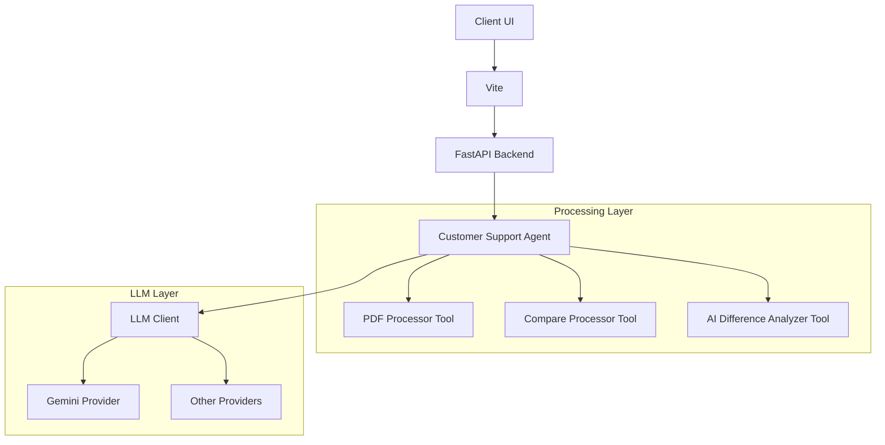
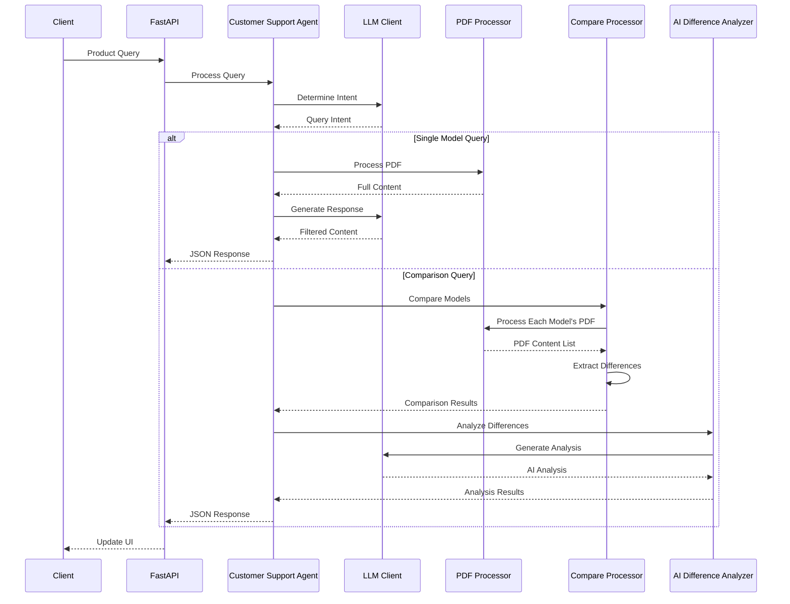

# AI-Driven Product Support System Architecture (Refactored)
Version: 2.0.0

## Overview

This document outlines the refactored architecture for the AI-Driven Product Support System. The refactoring focuses on simplifying the codebase by removing dependencies on Pydantic and Pydantic-AI while maintaining core functionality. The system implements the "Workflow: Routing" pattern as defined in Anthropic's research on building effective agents.

The application serves as a customer service agent chatbot for a magnetic sensor manufacturing company. It responds to queries about sensor products by extracting information from relevant PDF manuals. The agent can handle queries about single models or perform comparisons between multiple models. When comparing models, the system extracts differences and provides expert analysis on those differences.

### Key Refactoring Goals

1. **Simplification**
   - Remove dependencies on Pydantic and Pydantic-AI
   - Replace complex model structures with simple Python classes
   - Maintain the same JSON output format

2. **Pattern Implementation**
   - Implement the "Workflow: Routing" pattern
   - Create a customer support agent that routes to appropriate tools
   - Maintain clear separation of concerns

3. **Preservation**
   - Preserve the PDF extraction logic that uses pdfplumber and fitz
   - Maintain the comparison functionality
   - Ensure the same output format for API responses

4. **Abstraction**
   - Implement a simple LLM provider abstraction
   - Support Google Gemini Flash 1.5 as the default provider
   - Allow for easy switching between providers

## Core Components

### System Architecture



### Query Processing Workflow



## Component Details

### 1. Customer Support Agent

The Customer Support Agent (CSA) is the central orchestrator that routes queries to appropriate tools based on the query intent. It uses the LLM to determine the intent and then calls the appropriate tools to process the query.

```python
class CustomerSupportAgent:
    """Agent for handling customer support queries.
    
    This agent determines the intent of a query and routes it to the appropriate
    tool for processing. It handles both single model queries and comparison queries.
    """
    
    def __init__(self, llm_client, pdf_processor, compare_processor, ai_analyzer):
        """Initialize the agent with required tools."""
        self.llm_client = llm_client
        self.pdf_processor = pdf_processor
        self.compare_processor = compare_processor
        self.ai_analyzer = ai_analyzer
    
    async def process_query(self, query: str) -> dict:
        """Process a customer query and return a response.
        
        Args:
            query: The customer's query text
            
        Returns:
            JSON response with query results
        """
        # Determine query intent using LLM
        intent = await self._determine_intent(query)
        
        # Route to appropriate tool based on intent
        if intent.is_comparison:
            return await self._handle_comparison_query(query, intent)
        else:
            return await self._handle_single_model_query(query, intent)
    
    async def _determine_intent(self, query: str) -> QueryIntent:
        """Determine the intent of a query using the LLM.
        
        Args:
            query: The customer's query text
            
        Returns:
            QueryIntent object with intent information
        """
        # Implementation details...
    
    async def _handle_single_model_query(self, query: str, intent: QueryIntent) -> dict:
        """Handle a query about a single model.
        
        Args:
            query: The customer's query text
            intent: The determined query intent
            
        Returns:
            JSON response with query results
        """
        # Implementation details...
    
    async def _handle_comparison_query(self, query: str, intent: QueryIntent) -> dict:
        """Handle a query comparing multiple models.
        
        Args:
            query: The customer's query text
            intent: The determined query intent
            
        Returns:
            JSON response with comparison results
        """
        # Implementation details...
```

### 2. LLM Client

The LLM Client provides a simple abstraction for interacting with different LLM providers. It supports Google Gemini Flash 1.5 as the default provider but can be extended to support other providers.

```python
class LLMClient:
    """Client for interacting with LLM providers.
    
    This client provides a simple abstraction for sending prompts to different
    LLM providers and receiving responses.
    """
    
    def __init__(self, provider="gemini", config=None):
        """Initialize the client with a provider and configuration.
        
        Args:
            provider: The LLM provider to use (default: "gemini")
            config: Configuration for the provider
        """
        self.provider = provider
        self.config = config or {}
        self.provider_client = self._initialize_provider()
    
    def _initialize_provider(self):
        """Initialize the provider client based on the selected provider."""
        if self.provider == "gemini":
            return GeminiProvider(**self.config)
        # Add other providers as needed
        raise ValueError(f"Unsupported provider: {self.provider}")
    
    async def generate_text(self, prompt: str, system_prompt: str = None, **kwargs) -> str:
        """Generate text from a prompt.
        
        Args:
            prompt: The prompt to send to the LLM
            system_prompt: Optional system prompt for the LLM
            **kwargs: Additional parameters for the LLM
            
        Returns:
            Generated text from the LLM
        """
        return await self.provider_client.generate_text(prompt, system_prompt, **kwargs)
    
    async def generate_json(self, prompt: str, system_prompt: str = None, **kwargs) -> dict:
        """Generate JSON from a prompt.
        
        Args:
            prompt: The prompt to send to the LLM
            system_prompt: Optional system prompt for the LLM
            **kwargs: Additional parameters for the LLM
            
        Returns:
            Generated JSON from the LLM
        """
        return await self.provider_client.generate_json(prompt, system_prompt, **kwargs)
```

### 3. PDF Processor

The PDF Processor extracts content from PDF files containing product specifications. It maintains the same extraction logic but is refactored to use simple Python classes instead of Pydantic models.

```python
class PDFProcessor:
    """Service for processing PDF specifications.
    
    This class provides PDF processing functionality for extracting and structuring
    content from PDF files containing product specifications.
    
    Key capabilities:
    1. Extract text and tables from PDFs
    2. Parse features and advantages sections
    3. Process specification tables
    4. Extract and save diagrams
    5. Validate extracted content
    """
    
    def __init__(self, pdf_dir=None, diagram_dir=None):
        """Initialize the processor with directory paths.
        
        Args:
            pdf_dir: Directory containing PDF files
            diagram_dir: Directory for storing extracted diagrams
        """
        self.pdf_dir = Path(pdf_dir or "src/data/pdfs")
        self.diagram_dir = Path(diagram_dir or "src/data/diagrams")
        self.text_sections = ["features", "advantages", "notes"]
        self.section_patterns = {
            'electrical': 'electrical specifications',
            'magnetic': 'magnetic specifications',
            'physical': 'physical/operational specifications'
        }
        self.section_order = ["electrical", "magnetic", "physical"]
        self._current_file = None
    
    def get_content(self, model_or_path: str) -> dict:
        """Get PDF content from model number or file path.
        
        Args:
            model_or_path: Model number or file path
            
        Returns:
            Processed PDF content as a dictionary
            
        Raises:
            PDFProcessingError: If processing fails
        """
        # Implementation details preserved from original...
```

### 4. Compare Processor

The Compare Processor compares specifications between multiple products. It maintains the same comparison logic but is refactored to use simple Python classes instead of Pydantic models.

```python
class CompareProcessor:
    """Service for comparing PDF specifications.
    
    This class provides functionality for comparing multiple PDF specifications
    and identifying differences between them.
    
    Key capabilities:
    1. Compare features and advantages between products
    2. Analyze specification differences
    3. Generate structured comparison results
    4. Handle multiple product comparisons
    """
    
    def __init__(self, pdf_processor=None):
        """Initialize the processor with a PDF processor.
        
        Args:
            pdf_processor: PDF processor for extracting content
        """
        self.pdf_processor = pdf_processor or PDFProcessor()
    
    async def compare_models(self, model_numbers: list) -> dict:
        """Compare specifications between multiple models.
        
        Args:
            model_numbers: List of model numbers to compare
            
        Returns:
            Structured comparison data ready for API response
            
        Raises:
            Exception: If comparison fails
        """
        # Implementation details preserved from original...
```

### 5. AI Difference Analyzer

The AI Difference Analyzer uses the LLM to analyze differences between products and provide expert recommendations. It is refactored to use simple Python classes instead of Pydantic models and Pydantic-AI.

```python
class AIDifferenceAnalyzer:
    """Tool for AI analysis of product differences.
    
    This tool uses the LLM to analyze differences between products and provide
    expert recommendations based on those differences.
    """
    
    def __init__(self, llm_client=None):
        """Initialize the analyzer with an LLM client.
        
        Args:
            llm_client: LLM client for generating analysis
        """
        self.llm_client = llm_client or LLMClient()
    
    async def analyze_differences(self, comparison: dict, query_intent: dict) -> dict:
        """Analyze differences from comparison results using AI.
        
        Args:
            comparison: Results from CompareProcessor containing differences
            query_intent: What aspects to focus on
            
        Returns:
            AI analysis of the differences
            
        Raises:
            ValueError: If no differences found in comparison
        """
        # Implementation details...
```

### 6. Configuration

The configuration is simplified to use a simple Python class instead of Pydantic Settings.

```python
class Config:
    """Application configuration.
    
    This class provides configuration settings for the application, loaded from
    environment variables or default values.
    """
    
    def __init__(self):
        """Initialize the configuration with default values."""
        # Path Configuration
        self.data_dir = Path("src/data")
        self.pdf_dir = Path("src/data/pdfs")
        self.diagram_dir = Path("src/data/diagrams")
        self.processed_dir = Path("src/data/processed")
        
        # LLM Configuration
        self.default_model = "google-gla:gemini-1.5-flash"
        self.default_temperature = 0.3
        self.max_retries = 3
        self.request_timeout = 60
        
        # Create directories if they don't exist
        self.data_dir.mkdir(parents=True, exist_ok=True)
        self.pdf_dir.mkdir(parents=True, exist_ok=True)
        self.processed_dir.mkdir(parents=True, exist_ok=True)
    
    @classmethod
    def from_env(cls):
        """Load configuration from environment variables."""
        config = cls()
        # Load environment variables if available
        # Implementation details...
        return config
```

### 7. Data Models

The data models are simplified to use simple Python classes or dataclasses instead of Pydantic models.

```python
class QueryIntent:
    """Simple query intent for product analysis."""
    
    def __init__(self, domain, topic, sub_topic=None, context=None):
        """Initialize the query intent.
        
        Args:
            domain: Type of query (product, comparison, features)
            topic: Main topic (e.g., specifications, features)
            sub_topic: Specific section or aspect
            context: Additional context for the query
        """
        self.domain = domain
        self.topic = topic
        self.sub_topic = sub_topic
        self.context = context or {}
    
    @property
    def is_comparison(self):
        """Check if this is a comparison query."""
        return self.domain == "comparison"
```

## Directory Structure

```
src/ai_support_agent/
├── agents/                 # Agent implementations
│   └── customer_support_agent.py
├── tools/                  # Tool implementations
│   ├── pdf_processor.py
│   ├── compare_processor.py
│   └── ai_difference_analyzer.py
├── llm/                    # LLM client and providers
│   ├── llm_client.py
│   ├── gemini_provider.py
│   └── provider_base.py
├── models/                 # Data models
│   ├── query.py
│   ├── pdf.py
│   ├── comparison.py
│   └── differences.py
├── config/                 # Configuration
│   └── config.py
├── utils/                  # Utility functions
│   ├── transformers.py
│   └── validators.py
├── api/                    # API endpoints
│   └── routes.py
├── exceptions.py           # Custom exceptions
└── main.py                 # Application entry point

src/data/
├── diagrams/               # Diagrams extracted from PDFs
└── pdfs/                   # Source PDFs to be extracted from

scripts/                    # Testing scripts
├── test_pdf_processor.py
├── test_compare_processor.py
└── test_csa_agent.py

frontend/                   # Frontend implementation root
```

## Implementation Details

### 1. Routing Pattern Implementation

The Customer Support Agent implements the "Workflow: Routing" pattern by:
1. Determining the intent of a query using the LLM
2. Routing the query to the appropriate tool based on the intent
3. Handling the response from the tool and returning it to the client

```python
async def process_query(self, query: str) -> dict:
    """Process a customer query and return a response."""
    # Determine query intent using LLM
    intent = await self._determine_intent(query)
    
    # Route to appropriate tool based on intent
    if intent.is_comparison:
        return await self._handle_comparison_query(query, intent)
    else:
        return await self._handle_single_model_query(query, intent)
```

### 2. LLM Provider Abstraction

The LLM Client provides a simple abstraction for interacting with different LLM providers:

```python
class LLMProvider:
    """Base class for LLM providers."""
    
    async def generate_text(self, prompt: str, system_prompt: str = None, **kwargs) -> str:
        """Generate text from a prompt."""
        raise NotImplementedError("Subclasses must implement this method")
    
    async def generate_json(self, prompt: str, system_prompt: str = None, **kwargs) -> dict:
        """Generate JSON from a prompt."""
        raise NotImplementedError("Subclasses must implement this method")


class GeminiProvider(LLMProvider):
    """Provider for Google Gemini."""
    
    def __init__(self, api_key=None, **kwargs):
        """Initialize the provider with an API key."""
        self.api_key = api_key
        self.model = kwargs.get("model", "google-gla:gemini-1.5-flash")
        self.temperature = kwargs.get("temperature", 0.3)
        # Initialize the client
        # Implementation details...
    
    async def generate_text(self, prompt: str, system_prompt: str = None, **kwargs) -> str:
        """Generate text from a prompt."""
        # Implementation details...
    
    async def generate_json(self, prompt: str, system_prompt: str = None, **kwargs) -> dict:
        """Generate JSON from a prompt."""
        # Implementation details...
```

### 3. PDF Extraction Preservation

The PDF Processor preserves the extraction logic from the original implementation:

```python
def _extract_content(self, path: Path) -> dict:
    """Extract content from PDF file."""
    try:
        # Get raw text
        text = self._extract_text(str(path))
        
        # Extract model number from filename
        model_name = self._extract_model_name(path.name)
        
        # Extract tables
        tables = self._extract_tables(text)
        
        # Create pages
        pages = [{"number": 1, "text": text, "tables": tables}]
        
        # Process features and advantages
        sections = self._parse_features_advantages(text, tables) or {}
        
        # Process specification tables
        spec_sections = self._process_specification_tables(text, tables)
        sections.update(spec_sections)
        
        # Extract and save diagram
        # Implementation details...
        
        return {
            "raw_text": text,
            "metadata": {},
            "pages": pages,
            "model_number": model_name,
            "sections": sections
        }
    except Exception as e:
        raise PDFProcessingError(f"Failed to extract content: {str(e)}")
```

### 4. Error Handling

The implementation includes proper error handling throughout the codebase:

```python
class PDFProcessingError(Exception):
    """Base class for PDF processing errors."""
    pass


class PDFExtractionError(PDFProcessingError):
    """Error extracting content from PDF."""
    pass


class PDFValidationError(PDFProcessingError):
    """Error validating PDF content."""
    pass


class ComparisonError(Exception):
    """Error comparing products."""
    pass


class LLMError(Exception):
    """Error interacting with LLM."""
    pass
```

## Critical Implementation Requirements

This implementation follows these cursor rules:
- Python core best practices
- Documentation standards
- Error handling best practices
- Dependency injection
- Single responsibility principle

In case of conflicts between this document and cursor rules, the cursor rules take precedence.

## Migration Strategy

The migration from the current implementation to the refactored implementation will be done in phases:

1. **Phase 1: Core Components**
   - Implement the LLM Client and providers
   - Refactor the PDF Processor
   - Refactor the Compare Processor
   - Refactor the AI Difference Analyzer

2. **Phase 2: Agent Implementation**
   - Implement the Customer Support Agent
   - Implement the routing logic
   - Connect the agent to the tools

3. **Phase 3: API Integration**
   - Refactor the API endpoints
   - Connect the API to the Customer Support Agent
   - Test the end-to-end flow

4. **Phase 4: Frontend Integration**
   - Refactor the frontend to work with the new API
   - Test the end-to-end flow with the frontend

## Conclusion

This refactored architecture simplifies the codebase by removing dependencies on Pydantic and Pydantic-AI while maintaining core functionality. It implements the "Workflow: Routing" pattern for agent implementation and provides a clean abstraction for LLM provider integration. The PDF extraction and comparison logic are preserved to ensure the same output format for API responses.

The implementation follows Python best practices as defined in the cursor rules and provides a clean, maintainable, and extensible codebase for the AI-Driven Product Support System. 